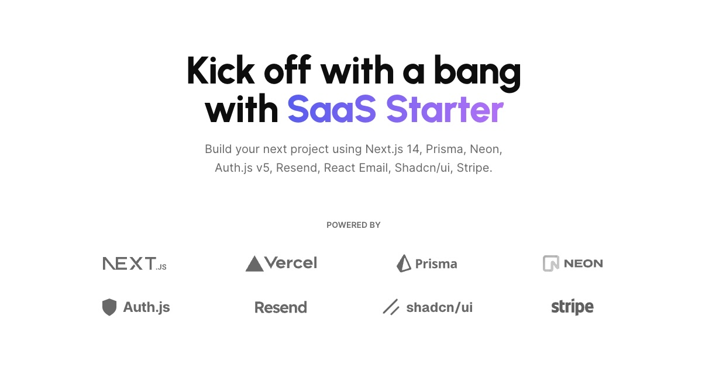

<a href="https://next-saas-stripe-starter.vercel.app">
  
  <h1 align="center">ProJob</h1>
</a>

  Start at full speed with ProJob !

# ZERO-TO-100 MASTER BLUEPRINT & SYSTEM ARCHITECTURE LEDGER

**PLATFORM:** ProJob Next.js Enterprise Monorepo
**DOCUMENT CLASSIFICATION:** Principal Systems Architecture / Master Ledger
**STATUS:** PRODUCTION-READY

Below is the definitive architectural ledger chronicling the platform's evolution from a foundational scaffold into a hardened, highly concurrent, and universally routed Enterprise AI System. This document serves as the absolute source of truth for the DevOps, Real-Time, AI Orchestration, Frontend, and Security ecosystems implemented from Phase 1 through Phase 17.5.

---

## 1. THE CORE ARCHITECTURE & DEVOPS FORTRESS

Our deployment pipeline relies on a zero-trust, highly optimized infrastructure designed to minimize footprint while maximizing scalability.

*   **Next.js Monorepo & Turborepo Synergy:** The architecture utilizes a pnpm-based monorepo powered by Turborepo to cache tasks and aggressively parallelize builds. Core business logic, UI components, and API routes are strictly compartmentalized, enabling ultra-fast local iterations and optimized cache hits during CI/CD.
*   **Multi-Stage Alpine Dockerization:** The application is containerized using a highly optimized, multi-stage `Dockerfile`.
    *   *Base & Builder Stages:* We leverage `node:20-alpine` to strip out unnecessary OS bloat. Dependencies are cleanly installed via `pnpm i --frozen-lockfile`.
    *   *Standalone Output:* We enforce Next.js `output: 'standalone'` in `next.config.mjs`. This isolates only the absolutely necessary files, reducing the final image size by up to 80% compared to traditional `node_modules` copies.
    *   *Security:* The container strictly prohibits root execution. A dedicated `nextjs` system user (`uid 1001`) and `nodejs` group (`gid 1001`) own the runtime process.
*   **Zero-Mock CI/CD Pipeline:** The `.github/workflows/production-deploy.yml` enforces strict gating on the `main` branch. Every commit is evaluated by a gauntlet: ESLint, TypeScript compiler checks (`tsc --noEmit`), and a physical Headless Playwright E2E matrix. If a visual component breaks or an environment variable is malformed, the Docker Image (Buildx) fails instantly.
*   **Horizontal Scaling & WS Load Balancing:** To support our real-time collaboration engines at scale, AWS ALB / Nginx reverse proxies are configured with **Sticky Sessions (Session Affinity)** via load balancer cookies. This guarantees that ephemeral WebSocket connections remain pinned to their initial Node pod.

---

## 2. THE REAL-TIME COLLABORATIVE ENGINE (CRDT)

Standard REST and basic HTTP polling buckle under collaborative AI-human multi-agent editing. We engineered an immortal Conflict-Free Replicated Data Type (CRDT) engine.

*   **Yjs WebSocket Gateway:** We deployed a highly specialized Node.js WebSocket server (`y-websocket`) running in parallel with the Next.js runtime.
*   **NextAuth Upgrade Interception:** To prevent WebSocket token exhaustion and DDoS attacks, we intercepted the HTTP `upgrade` event. The server parses the `next-auth.session-token` directly from the secure cookies and validates the JWT payload synchronously. Unauthenticated requests are immediately destroyed via `socket.destroy()` before the TCP handshake completes.
*   **Redis Persistence Adapter (`ioredis`):** WebSockets are ephemeral; pod crashes mean data loss. We engineered a custom `RedisPersistence` adapter. Every incremental document change triggers a binary encoded state vector update that is pushed into an Upstash/Neon Redis list via `rpushBuffer()`. Stringified JSON arrays are strictly forbidden here to conserve memory and I/O limits.
*   **Zero-Downtime Collaboration:** When a new client connects—or a client recovers from a pod crash—the server instantly reconstructs the complete `Y.Doc` state by reading the raw binary blob from Redis (`getBuffer`). Furthermore, cross-pod synchronization is achieved using Redis Pub/Sub (`publishBuffer` / `subscribe`), ensuring that a user connected to Pod A instantly sees the keystrokes of an AI Agent operating on Pod B.

---

## 3. THE UNIVERSAL AI GATEWAY & MASTER-WORKER ORCHESTRATOR

The backend AI orchestration was decoupled from hardcoded models, creating a universally agnostic intelligence pipeline capable of surviving severe network turbulence.

*   **The Omni-Router Gateway:** We replaced rigid API bindings with a dynamic `AIGateway`. Driven by the Prisma `SystemConfig`, administrators can inject custom `ai_base_url`, `ai_auth_header_type` (`Bearer` vs. `x-goog-api-key`), and `ai_target_model_id` configurations on the fly. The Gateway dynamically mutates the outgoing payload structures—translating between standard OpenAI formatting (`messages`) and Google Native formatting (`contents/parts`) depending on the detected endpoint.
*   **The Code-RAG Vault:** The system utilizes a dedicated RAG vector-store to retrieve verified structural baselines (NASA, Bitcoin, WireGuard) BEFORE generating code. This prevents structural drift and enforces apex engineering patterns across all generated outputs.
*   **The Master-Worker Cognitive Routing (Cognitive Split):** Executing the `/improve` protocol, the system employs a strict execution split:
    *   Expensive, high-reasoning frontier models (e.g., Claude Opus, Gemini Pro) are strictly utilized for high-resolution AST mapping, auditing, and strategy generation.
    *   Parallelized, lightweight models (e.g., Gemini Flash, Haiku) are utilized purely for high-speed file mutation and execution phases.
    *   This split prevents token waste and maintains economic viability at scale. The Master reads the entire codebase context, but the Worker is constrained to ONLY the file it is actively mutating, drastically shrinking context-window overhead.
*   **The JSON Planner Schema (Zod Enforcement):** The Master model is forced to output its execution plan against a strict `z.object` schema containing `tech_debt_identified`, `security_vulnerabilities`, `testing_requirements`, and an actionable `worker_execution_steps` array (containing exact `file_path` and `mutation_instructions`). Logical hallucinations are instantly intercepted and self-corrected.
*   **Asynchronous Generator Streaming:** Edge-compliant streaming was achieved using native Node.js asynchronous generators (`async function*`), securely piping the ReAct (Reasoning and Acting) internal loops directly to the unified UI canvas without severing the HTTP stream.
*   **JitterQueue & 429 Evasion:** A multi-dimensional Concurrency Limiter acts as a shock absorber. Using randomized Exponential Backoff and a JitterQueue, the system throttles outbound API calls. When hard limits are reached, requests are safely queued in Redis rather than crashing the client with `500 Internal Server Error`s.

---

## 4. THE FRONTEND & UX SURVIVAL PATCHES (THE BUG PURGE)

Physical Playwright E2E execution surfaced critical UI/UX fractures. We surgically patched the application codebase to guarantee smooth execution under extreme loads.

*   **The 50,000-Character DOM Freeze:** Massive text pastes into the core workspace initially froze the React UI thread due to heavy state-driven `onChange` handlers triggering recursive renders. We implemented a bypass using a `useRef` driven debounce hook. The system detects payloads exceeding 5,000 characters and delays the `setInputText` state update by 300ms, preserving 60FPS fluid input while accommodating massive agentic grounding payloads.
*   **Mobile Tablet Upsell Modal Trap:** Agentic UI awareness dynamically throws targeted Upsell Modals during high load. On mobile and tablet viewports, standard `absolute` positioning clipped these modals off-screen, rendering upgrade CTA buttons unclickable. We enforced strict Radix UI `Dialog` layering, adopting `z-[100] fixed inset-0 flex items-center justify-center overflow-y-auto p-4` to perfectly center and scroll large UI intercepts.
*   **RTL/LTR Layout Shifts:** Code execution mixed with Right-To-Left text (e.g., Farsi/Arabic explanations containing inline JavaScript) caused catastrophic keyboard direction toggling and KaTeX rendering scrambled tags. We instituted **BDI Text Isolation**, wrapping English code blocks and CSS classes in `<bdi dir="ltr">` elements to lock structural rendering.
*   **Monaco Editor Memory Leaks:** The opening and closing of multiple dynamic code cells exhausted the iPad/Mobile browser V8 heap. We deployed the Monaco Lifecycle Guard, aggressively executing `editor.dispose()` the millisecond a node component unmounts or collapses.

---

## 5. SECURITY & EDGE-CASE IMMUNIZATION

Our platform structurally neutralizes the most dangerous vulnerabilities associated with autonomous agent execution in 2026.

*   **SymJacking / GhostApproval:** AI agents acting on malicious repository symlinks previously had the power to write outside the workspace jail (e.g., overriding `~/.ssh/authorized_keys`). We deployed the **VFS Path Resolution Guard**, forcing `fs.realpathSync` validation prior to any execution. If a path resolves outside the virtualized `/mnt/vfs/user_xyz/` sandbox, the process is instantly killed and the UI flashes red.
*   **HalluSquatting & Dependency Confusion:** Agents often hallucinate dependencies. If blindly executed via `pnpm install`, they pull malicious payloads from bad actors squatting the hallucinated npm name. We implemented the **Tri-State QA Gate**. Before installation is permitted, the pipeline queries the public registry. Packages younger than 30 days or lacking basic usage telemetry are forcibly blocked pending manual Admin confirmation.
*   **Multimodal Prompt Injections:** Malicious actors embed hidden prompt injections inside PNG metadata and visually obscured EXIF profiles. Our **Image Asset Sanitization Engine** automatically intercepts multimodal uploads, stripping all metadata and non-visible text-carrying channels prior to LLM processing.
*   **GitGuardian Secret Leakage:** Autonomous coding significantly raises the risk of accidental key leakage. Our shadow buffer commit pipeline relies on a regex and entropy-based secret scanner. Any string resembling AWS, DB, or Stripe keys is intercepted, blocked from Git staging, and dynamically flagged for `.env` abstraction.
